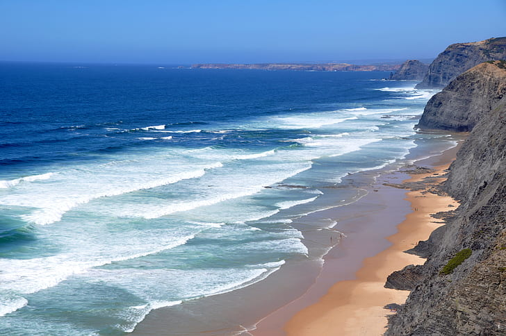

# ROSE-CV: Regional Ocean Surface Emulator — Cape Verde

## Repository Link

[https://github.com/Hannes2905/Regional-Ocean-Surface-Emulator---Cape-Verde.git](https://github.com/Hannes2905/Regional-Ocean-Surface-Emulator---Cape-Verde.git)

## Description

A data-driven emulator for predicting Sea Surface Temperature (SST) over the North West African Upwelling Region surrounding the Cape Verde Archipelago. The model takes the current week's mean SST field and predicts the following week's SST using a U-Net encoder-decoder architecture trained on 25 years (2000–2025) of CMEMS GLORYS12V1 ocean reanalysis data. Future iterations will increase the temporal resolution to daily predictions and expand the multivariate output to include ocean current velocities and mixed layer depth.

### Task Type

Regression (spatiotemporal grid-to-grid prediction)

### Results Summary

#### Best Model Performance
- **Best Model:** Deep Residual U-Net with residual (delta) prediction and boundary-aware weighting
- **Evaluation Metric:** Root Mean Square Error (RMSE) in °C, computed over ocean pixels only
- **Final Performance:** RMSE of **0.2985 °C** on the held-out test set (2021–2025)

#### Model Comparison

| Model Version | RMSE (°C) | Improvement over Persistence |
| :--- | :---: | :---: |
| Persistence Baseline | 0.3698 | — |
| Base U-Net | 0.3179 | 14.0% |
| Residual U-Net | 0.3046 | 17.6% |
| Boundary-Aware Residual U-Net | 0.3014 | 18.5% |
| **Deep Residual U-Net** | **0.2985** | **19.3%** |

#### Key Insights
- **Residual Prediction:** The single largest performance gain came from switching from direct state prediction to residual (delta) prediction, allowing the network to focus on physical dynamics rather than the static background temperature.
- **Boundary Handling:** Upweighting pixels near the land-mask interface improved coastal upwelling prediction, confirming the importance of specialized treatment at land-sea boundaries.
- **Architectural Depth:** Adding an extra encoder-decoder level expanded the receptive field and improved the model's ability to contextualize local changes within larger mesoscale patterns.
- **Model Strengths:** All U-Net variants outperform persistence, demonstrating learned advective and diffusion physics. The architecture is lightweight and trainable on a single GPU.
- **Model Limitations:** Remaining error likely stems from the absence of additional physical drivers (current velocities, mixed layer depth) and the smoothing effect of bilinear upsampling from the native 253×253 grid to 512×512. Extreme SST shifts during rapid transitions remain the hardest to predict.

## Technical Approach

### Data
- **Source:** [CMEMS GLORYS12V1](https://data.marine.copernicus.eu/product/GLOBAL_MULTIYEAR_PHY_001_030/description) ocean reanalysis (1/12° resolution, 50 depth levels)
- **Region:** 32.50°W–11.50°W / 5.00°N–26.00°N (North West African Upwelling Region)
- **Variable:** Potential Temperature (thetao) at 0.49 m depth
- **Temporal Span:** 2000–2025 (9,489 daily snapshots → 1,357 weekly means)
- **Spatial Resolution:** Native 253×253 upsampled to 512×512 via bilinear interpolation
- **Split:** 80% train (2000–2020) / 20% test (2021–2025)

### Architecture
- **Backbone:** 2D U-Net encoder-decoder with skip connections
- **Embedder:** Concatenates current state and previous timestep along the channel dimension
- **Prediction Mode:** Residual — the U-Net predicts the weekly SST delta, added back to the input state
- **Loss:** Masked MSE (ocean pixels only, land masked out)
- **Optimizer:** AdamW with cosine-warmup learning rate schedule
- **Framework:** PyTorch Lightning + Hydra configuration management

### Pipeline
The training pipeline is fully configuration-driven via Hydra YAML files:
- `configs/config.yaml` — global experiment settings (seed, steps, logging)
- `configs/dataloader/CMEMS.yaml` — dataset path, variables, normalization
- `configs/module/DESIM.yaml` — model architecture and embedder settings
- `configs/cluster/local.yaml` — hardware settings (precision, batch size, GPUs)

> **Note:** The U-Net backbone source code (`backbone_src/`) is not included due to licensing and authorship constraints. The repository provides all surrounding infrastructure (data loading, training loop, evaluation, configuration).

## Documentation

1. **[Literature Review](0_LiteratureReview/README.md)** — Survey of AI ocean emulators (Samudra, GLONET, ST-UNet) and strategic roadmap
2. **[Dataset Characteristics](1_DatasetCharacteristics/README.md)** — Exploratory data analysis, data engineering, and final dataset overview
3. **[Baseline Model](2_BaselineModel/README.md)** — Persistence forecast baseline (RMSE: 0.3698 °C)
4. **[Model Definition and Evaluation](3_Model/model_definition_evaluation.ipynb)** — Four U-Net iterations with comparative analysis
5. **[Presentation](4_Presentation/README.md)** — Project presentation slides

## Cover Image

